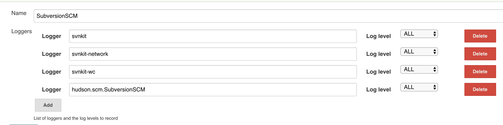

Jenkins Subversion Plugin
=========================

This plugin adds the Subversion support (via SVNKit) to Jenkins.

# Basic Usage

Once this plugin is installed, you'll see Subversion as one of the
options in the SCM section of job configurations. See inline help for
more information about how to use it.

### Usage with Server Certificates

An important note for those wanting to use client certificates to
authenticate to your subversion server.   Your PKCS12 cert file must not
have a blank passphrase or a blank export password as it will cause
authentication to fail. Refer to
[SVNKit:0000271](http://issues.tmatesoft.com/issue/SVNOLD-271 "SVNKit:0000271")
for more details.

# Advanced Features/Configurations

## Proxy

You can set the proxy
in C:/Users/\<user\>/AppData/Roaming/Subversion/servers (Windows)  or
\~/.subversion/servers (Linux)

*(Jenkins as a service on Windows
: C:\\Windows\\SysWOW64\\config\\systemprofile\\AppData\\Roaming\\Subversion\\servers)*

> There's a tension between doing this in Jenkins vs following the
> existing Subversion convention — the former has a benefit of being
> available on all the slaves. In this case, the proxy is a system
> dependent setting, which might be different between different slaves,
> so I think it makes sense to keep it in \~/.subversion/servers.
> (See <https://issues.jenkins-ci.org/browse/JENKINS-4041>)

## Post-commit hook

Jenkins can poll Subversion repositories for changes, and while this is
reasonably efficient, this can only happen up to every once a minute, so
you may still have to wait a full minute before Jenkins detects a
change.

To reduce this delay, you can set up [a post commit
hook](http://svnbook.red-bean.com/en/1.5/svn.reposadmin.create.html#svn.reposadmin.create.hooks)
so the Subversion repository can notify Jenkins whenever a change is
made to that repository. To do this, put the following script in your
`post-commit` file (in the $REPOSITORY/hooks directory):

    REPOS="$1"
    REV="$2"
    UUID=`svnlook uuid $REPOS`
    /usr/bin/wget \
      --header "Content-Type:text/plain;charset=UTF-8" \
      --post-data "`svnlook changed --revision $REV $REPOS`" \
      --output-document "-" \
      --timeout=2 \
      http://server/subversion/${UUID}/notifyCommit?rev=$REV

Notice the rev=$REV parameter, this tells Jenkins to check out exactly
the revision which was reported by the hook. If your job has multiple
Subversion module locations defined, this may lead to inconsistent
checkouts - so it's recommended to leave out '?rev=$REV' in that case.  
You may also want to leave out the '?rev=$REV' parameter if you are
using Maven to release your projects and do not want Jenkins to build
the intermediate prepare-release commit (ie: the released artifacts).  
See [JENKINS-14254](https://issues.jenkins-ci.org/browse/JENKINS-14254)
for details.

Jobs on Jenkins need to be configured with the SCM polling option to
benefit from this behavior. This is so that you can have some jobs that
are never triggered by the post-commit hook (in the $REPOSITORY/hooks
directory), such as release related tasks, by omitting the SCM polling
option.
The configured polling can have any schedule (probably infrequent like
monthly or yearly). The net effect is as if polling happens out of their
usual cycles.

For this to work, your Jenkins has to allow anonymous read access
(specifically, "Job \> Read" access) to the system. If access control to
your Jenkins is more restrictive, you may need to specify the username
and password, depending on how your authentication is configured.

If your Jenkins uses the "Prevent Cross Site Request Forgery exploits"
security option, the above request will be rejected with 403 errors ("No
valid crumb was included"). The crumb needed in this request can be
obtained from the URL `http:``//server/crumbIssuer/api/xml` (or
`/api/json`). This can be included in the wget call above with something
like this:

    --header `wget -q --output-document - \
      'http://server/crumbIssuer/api/xml?xpath=concat(//crumbRequestField,":",//crumb)'`

### Considerations

Since `wget` by default retries up to **20 times** when not succeeding
within the given timeout, `--timeout=2` on a slow SVN server may cause
Jenkins to scan the repository many more times than needed, further
slowing down the SVN Server which after a while makes Jenkins
unresponsive.

Possible solutions to this problem are to increase the timeout, to add a
lower maximum number of retries using the argument `--retries=3` or to
make the `wget` call asynchronous (and thus ignoring any communication
errors) by adding `2>&1 &` last on the `wget` call.

Having the timeout too low can also cause your commits to hang and throw
either 502 errors if you are behind a proxy, or post-commit errors if
not.  Increasing the timeout until you no longer see wget retrying
should fix the issue.

###  More robust \*nix post-commit hook example

The basic script above is fine if your server does not do authentication
or you have no problem providing anonymous read access to Jenkins (as
well as anonymous read to all the individual jobs you want to trigger if
you are using project-based matrix authorization). Here is a script that
includes the more robust security concepts hinted at in the basic
example. 

    #!/bin/sh
    REPOS="$1"
    REV="$2"

    # No environment is passed to svn hook scripts; set paths to external tools explicitly:
    WGET=/usr/bin/wget
    SVNLOOK=/usr/bin/svnlook

    # If your server requires authentication, it is recommended that you set up a .netrc file to store your username and password
    # Better yet, since Jenkins v. 1.426, use the generated API Token in place of the password
    # See https://wiki.jenkins-ci.org/display/JENKINS/Authenticating+scripted+clients
    # Since no environment is passed to hook scripts, you need to set $HOME (where your .netrc lives)
    # By convention, this should be the home dir of whichever user is running the svn process (i.e. apache)
    HOME=/var/www/

    UUID=`$SVNLOOK uuid $REPOS`
    NOTIFY_URL="subversion/${UUID}/notifyCommit?rev=${REV}"
    CRUMB_ISSUER_URL='crumbIssuer/api/xml?xpath=concat(//crumbRequestField,":",//crumb)'

    function notifyCI {
        # URL to Hudson/Jenkins server application (with protocol, hostname, port and deployment descriptor if needed)
        CISERVER=$1

        # Check if "[X] Prevent Cross Site Request Forgery exploits" is activated
        # so we can present a valid crumb or a proper header
        HEADER="Content-Type:text/plain;charset=UTF-8"
        CRUMB=`$WGET --auth-no-challenge --output-document - ${CISERVER}/${CRUMB_ISSUER_URL}`
        if [ "$CRUMB" != "" ]; then HEADER=$CRUMB; fi

        $WGET \
            --auth-no-challenge \
            --header $HEADER \
            --post-data "`$SVNLOOK changed --revision $REV $REPOS`" \
            --output-document "-"\
            --timeout=2 \
            ${CISERVER}/${NOTIFY_URL}
    }

    # The code above was placed in a function so you can easily notify multiple Jenkins/Hudson servers:
    notifyCI "http://myPC.company.local:8080"
    notifyCI "http://jenkins.company.com:8080/jenkins"

The script above takes care of the Prevent Cross Site Request Forgery
exploits option if you have it enabled on your server. If you do not
have that option enabled, the extra wget call is harmless, but feel free
to remove it if you do not need it. The script above also requires that
you set up a .netrc file in the home directory of the user you are
running subversion as (either the svnserve process or httpd). For more
info on .netrc file syntax, look
[here](http://www.mavetju.org/unix/netrc.php). The
script above makes it easy to notify multiple Jenkins servers of the
same SVN commit. If you have a .netrc file, it keeps it easy even if
they have different admin users set up. If you don't want to mess with a
.netrc file, you could just hard-code the user and password (or API
Token) info in the file and add --username=user and --password="pass"
flags to the wget calls. 

### Windows specific post-commit hook

The above script is difficult under the Windows command processor seeing
as there is no support for backtick output extraction and there is no
built in wget command. Instead the following contents can be added to
`post-commit.bat` (in the $REPOSITORY/hooks directory):

    SET REPOS=%1
    SET REV=%2
    SET CSCRIPT=%windir%\system32\cscript.exe
    SET VBSCRIPT=C:\Repositories\post-commit-hook-jenkins.vbs
    SET SVNLOOK=C:\Subversion\svnlook.exe
    SET JENKINS=http://server/
    REM AUTHORIZATION: Set to "" for anonymous acceess
    REM AUTHORIZATION: Set to encoded Base64 string, generated from "user_id:api_token" 
    REM                found on Jenkins under "user/configure/API token"
    REM                User needs "Job/Read" permission on Jenkins
    SET AUTHORIZATION=""
    "%CSCRIPT%" "%VBSCRIPT%" "%REPOS%" %2 "%SVNLOOK%" %JENKINS% %AUTHORIZATION%

The batch file relies on the following VBScript being available in the
file designated by the `VBSCRIPT` variable above:

    repos         = WScript.Arguments.Item(0)
    rev           = WScript.Arguments.Item(1)
    svnlook       = WScript.Arguments.Item(2)
    jenkins       = WScript.Arguments.Item(3)
    authorization = WScript.Arguments.Item(4)

    Set shell = WScript.CreateObject("WScript.Shell")

    Set uuidExec = shell.Exec(svnlook & " uuid " & repos)
    Do Until uuidExec.StdOut.AtEndOfStream
      uuid = uuidExec.StdOut.ReadLine()
    Loop
    Wscript.Echo "uuid=" & uuid

    Set changedExec = shell.Exec(svnlook & " changed --revision " & rev & " " & repos)
    Do Until changedExec.StdOut.AtEndOfStream
      changed = changed + changedExec.StdOut.ReadLine() + Chr(10)
    Loop
    Wscript.Echo "changed=" & changed

    url = jenkins + "crumbIssuer/api/xml?xpath=concat(//crumbRequestField,"":"",//crumb)"
    Set http = CreateObject("Microsoft.XMLHTTP")
    http.open "GET", url, False
    http.setRequestHeader "Content-Type", "text/plain;charset=UTF-8"
    if not authorization = "" then
      http.setRequestHeader "Authorization", "Basic " + authorization
    end if
    http.send
    crumb = null
    if http.status = 200 then
      crumb = split(http.responseText,":")
    end if

    url = jenkins + "subversion/" + uuid + "/notifyCommit?rev=" + rev
    Wscript.Echo url

    Set http = CreateObject("Microsoft.XMLHTTP")
    http.open "POST", url, False
    http.setRequestHeader "Content-Type", "text/plain;charset=UTF-8"
    if not authorization = "" then
      http.setRequestHeader "Authorization", "Basic " + authorization
    end if
    if not isnull(crumb) then 
      http.setRequestHeader crumb(0),crumb(1)
    end if
    http.send changed
    if http.status <> 200 then
      Wscript.Echo "Error. HTTP Status: " & http.status & ". Body: " & http.responseText
    end if

## Perform Polling from the Master

JIRA [JENKINS-5413](https://issues.jenkins-ci.org/browse/JENKINS-5413)
documents problems with running the SCM polling trigger on slaves.
Version 1.21 of the Subversion plugin can perform the polling on the
Jenkins master if the hudson.scm.SubversionSCM.pollFromMaster system
property is set to true.

## Subversion Revision and URL information as Environment Variables

The Subversion SCM plugin exports the svn revisions and URLs of the
build's subversion modules as environment variables. These
are $SVN\_REVISION\_n and $SVN\_URL\_n, where n is the 1-based index of
the module in the configuration.

For backwards compatibility if there's only a single module, its values
are also exported as $SVN\_REVISION and $SVN\_URL.

Note that the revision number exposed is the 'last-changed' revision
number of the particular directory and not the current revision of the
repository. (See [What are these two revision numbers in svn
info?](http://stackoverflow.com/questions/9354877/what-are-these-two-revision-numbers-in-svn-info))

## Kerberos authentication

To connect to a Kerberos authenticated SVN repository see the
[Subversion Plugin HTTPS Kerberos
authentication](https://wiki.jenkins.io/display/JENKINS/Subversion+Plugin+HTTPS+Kerberos+authentication)
page.

# TroubleShooting

Someone suggested in the Jenkins IRC channel that if you are getting an
error and a long svnkit stack trace that looks like:

     ERROR: svn: authentication cancelled

    org.tmatesoft.svn.core.SVNCancelException: svn: authentication cancelled

Then,

-   Try to delete (back up) the \~/.subversion folder and retry the
    build. Apparently mixing the command line svn client checkouts with
    those of your Jenkins jobs messes it up.
-   See
    <http://blog.vinodsingh.com/2009/08/hudson-svn-authentication-cancelled.html>
    for details.

  

You could try to enable verbose log over the plugin an SVNKit library,
to do that add a logger to those loggers with log level ALL , it is
really verbose so just after configure it make the test and change the
log level again to ERROR or INFO.

-   svnkit
-   svnkit-network
-   svnkit-wc
-   hudson.scm.SubversionSCM

{.confluence-embedded-image
height="250"}

  

## lightweight checkout capability for Subversion on Multibranch Pipeline projects and Externals support

Lightweight checkout capability for Subversion on Multibranch Pipeline
projects does not support externals, so in order to use Subversion
plugin in a Multibranch Pipeline project with a repository with
externals, you should disable the lightweight checkout capability by
setting the property
\`-Djenkins.scm.impl.subversion.SubversionSCMFileSystem.disable=\<true/false\>\`

# Change Log

## Version 2.12.2 and newer

See [GitHub releases](https://github.com/jenkinsci/subversion-plugin/releases).

## Older

See the [old changelog](docs/old-changelog.md).

# Trademarks

Apache, Apache Subversion and Subversion are trademarks of the Apache
Software Foundation
